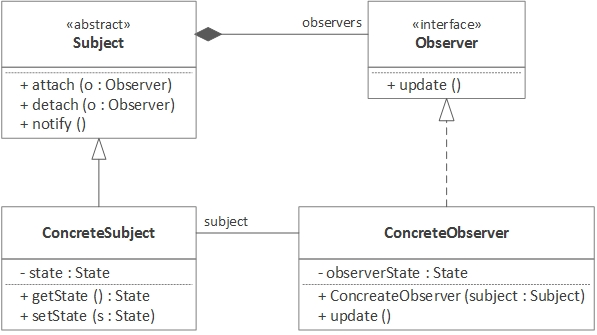

# Java Techniques - exercises
###### Kamil Cecherz

---

### Asymmetric Data And Object

###### project inspired by publication:
* [Czysty kod. Podręcznik dobrego programisty - Robert C. Martin](https://helion.pl/ksiazki/czysty-kod-podrecznik-dobrego-programisty-robert-c-martin,czykov.htm#format/d)
<br /> s.115 | **Listing 6.5**
  
---

### Observer Pattern

#### Cave

###### project inspired by [Wiki site](https://en.wikipedia.org/wiki/Observer_pattern#Java)

```
While the library classes java.util.Observer and java.util.Observable exist, 
they have been deprecated in Java 9 because the model implemented was quite limited.

Below is an example written in Java that takes keyboard input and treats each input line as an event. 
When a string is supplied from System.in, the method notifyObservers is then called, in order to notify 
all observers of the event's occurrence, in the form of an invocation of their 'update' methods.
```
<br />


#### Mailer

###### project inspired by site [HowDoInJava](https://howtodoinjava.com/design-patterns/behavioral/observer-design-pattern/)

```
The flow is very simple to understand. Application creates the concrete subject object. All concrete observers 
register themselves to be notified for any further update in the state of subject.
```
<br />



---

### Strategy Pattern

Programs use **Junit 4**. If you can show result you must 
add [external lib](https://www.jetbrains.com/help/idea/library.html) to project.

###### Junit 4 - specification on site: [here](https://junit.org/junit4/)

